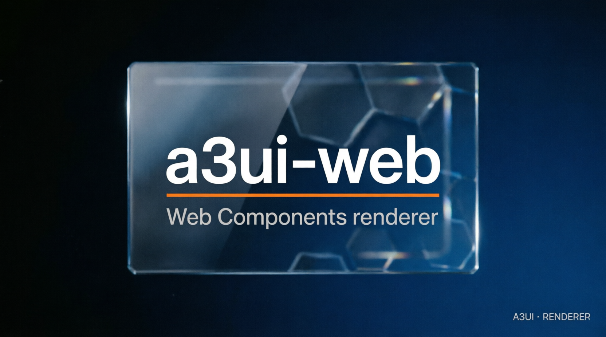

# a3ui-web — native Web Components renderer



## What it is

A TypeScript renderer built with native Web Components. It consumes the A3UI surface tuple and implements mark-to-CTA semantics, accessibility output, lifecycle, re-binding, and opaque extensions.

## What it is not

It is not a Compose port, not a UI framework, and not a claim that browser chrome is pixel-identical to another renderer. Runtime dependencies are zero.

## Status

- **VERIFIED:** W-001..W-025, Vitest, Playwright, typecheck, lifecycle/re-binding/extensions, and shared fixture semantics.
- **UNVERIFIED:** production adoption and non-Chromium browser certification beyond the declared gate.

## Get it

```bash
git clone https://github.com/valeriobitzone-png/a3ui-web.git
cd a3ui-web
# Requirements: Node.js >=20, npm, and a Chromium-capable Playwright install
npm install
npx playwright install chromium
```

Structure: `src/` Web Components, `test/` unit and browser conformance, `spec/` consumed A3UI contract, and `REVIEW_A3UI_WEB*.md` evidence.

## Prove it

```bash
npm run typecheck
npm test
```

Expected result: W-001..W-025 and the regression suite pass. Shared fixtures remain unchanged.

## Integrate it

Import the Web Components into your project, consume the shared fixtures, and preserve the A3UI mark→CTA mapping: CONTRADICTED and PENDING disable confirmation; STALE exposes age/warning; FACT is the enabled baseline. Unknown `x-*` extensions are ignored without invalidating the surface.

## License

Implementation code is Apache-2.0. The consumed A3UI specification is CC BY 4.0 in the source A3 repository.

## Provenance

Measured: DOM assertions, browser tests, accessibility output, and fixture comparisons. Pixel details and browser/device behavior outside the declared gate remain unverified; review files record divergences rather than silently reconciling them.
